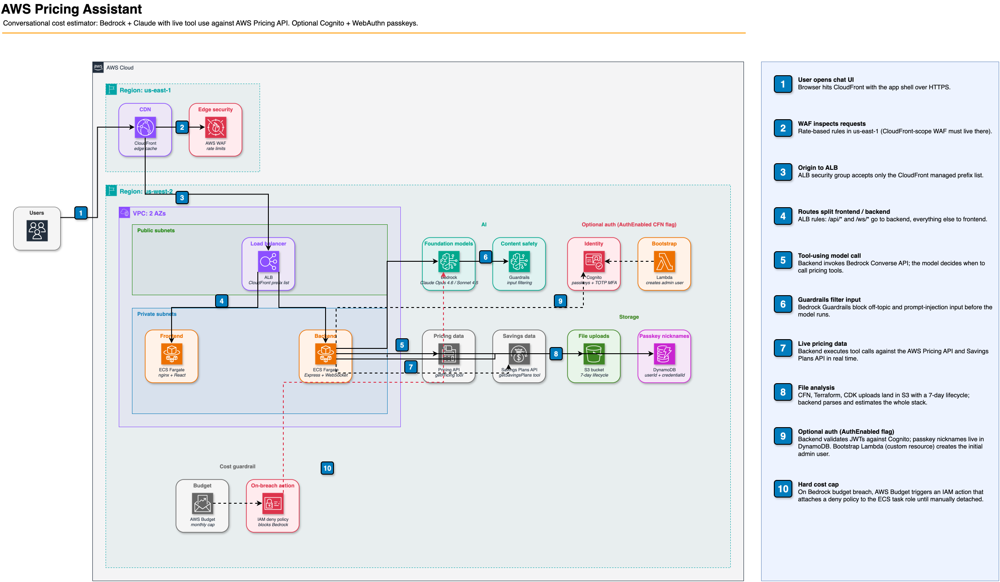
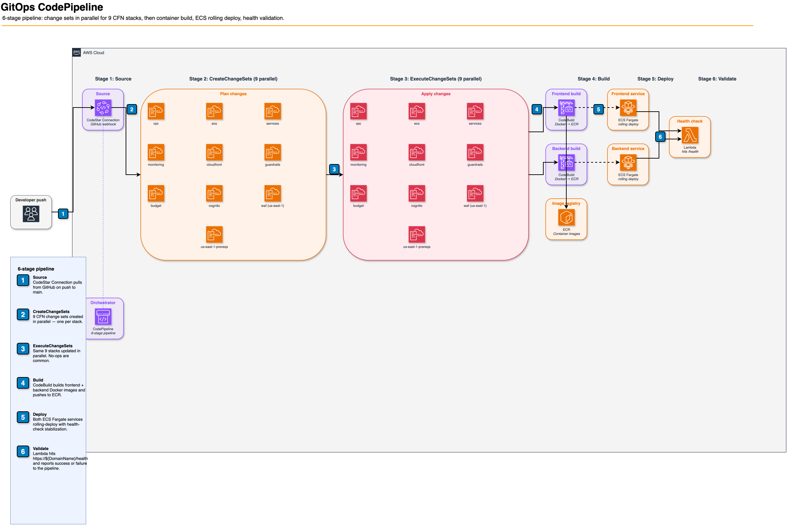

# AWS Pricing Assistant

Conversational AWS cost estimator. Sample reference architecture using Amazon Bedrock + Claude with the AWS Pricing API and Savings Plans API for live, tool-using cost estimates. Frontend on ECS Fargate, CloudFront + WAF, optional Cognito auth, GitOps CodePipeline.

## ⚠️ Disclaimer

This is sample code, for non-production usage. You should work with your security and legal teams to meet your organizational security, regulatory and compliance requirements before deployment.

Cost figures returned by this application are AI-generated using foundation models on Amazon Bedrock. Outputs may be inaccurate, incomplete, or out of date. Always verify estimates against the [AWS Pricing Calculator](https://calculator.aws/) and the [AWS Pricing pages](https://aws.amazon.com/pricing/) before making purchasing or budgeting decisions.

## 🚀 Features

- 🌙 **Dark/Light Theme**: Responsive web interface with theme toggle
- 💬 **Real-time Chat**: WebSocket-powered streaming responses with heartbeat
- 📊 **Live Pricing Data**: AWS Bedrock Agent with built-in AWS Pricing API tools
- 📁 **File Analysis**: Upload and analyze CloudFormation, Terraform, CDK files
- 🔄 **Multiple Files**: Combined cost estimation for entire infrastructure
- 🛡️ **Security**: File validation, content scanning, and secure uploads
- ⚡ **Claude Opus 4.6**: Default model with advanced reasoning via CRIS inference profiles
- 📱 **Mobile Responsive**: Optimized for all device sizes
- 🔒 **CloudFront CDN**: Global edge caching with CloudFront prefix list security
- 📈 **Comprehensive Monitoring**: CloudWatch dashboard with alerts and observability
- 🧠 **Enhanced Memory**: Invisible conversation history injection for better context continuity

## 🏗️ Architecture



> Editable source: [`docs/aws-pricing-assistant-architecture.drawio`](docs/aws-pricing-assistant-architecture.drawio) — open in [draw.io](https://app.diagrams.net/)

### GitOps CI/CD Pipeline Architecture



> Editable source: [`docs/cicd-pipeline-architecture.drawio`](docs/cicd-pipeline-architecture.drawio)

### Regenerating diagrams

Diagrams are produced by the [`aws-architecture-diagram` skill](https://github.com/awslabs/agent-plugins/tree/main/plugins/deploy-on-aws/skills/aws-architecture-diagram) from the `awslabs/agent-plugins` `deploy-on-aws` plugin (replacing the deprecated `awslabs.aws-diagram-mcp-server`). To regenerate:

```bash
# 1. Install draw.io desktop (one time, for PNG export)
brew install --cask drawio

# 2. Run the skill via headless Claude Code, Kiro CLI, or Amazon Q with the plugin loaded
#    (see https://builder.aws.com/content/3Dd4PzYvNS7knkGhX5qNvtkcbkf for the migration write-up)
#    Prompt: "Use the aws-architecture-diagram skill in analyze mode to generate
#             docs/aws-pricing-assistant-architecture.drawio and
#             docs/cicd-pipeline-architecture.drawio"

# 3. Export PNG previews
drawio -x -f png -o docs/aws-pricing-assistant-architecture.png docs/aws-pricing-assistant-architecture.drawio
drawio -x -f png -o docs/cicd-pipeline-architecture.png docs/cicd-pipeline-architecture.drawio
```

### Current AWS Infrastructure:
- **CloudFront CDN**: Global edge caching with CloudFront prefix list security (pl-82a045eb)
- **Frontend**: React app running on ECS Fargate (2 tasks)
- **Backend**: Node.js API on ECS Fargate (2 tasks) 
- **Load Balancer**: ALB with HTTPS-only listener, locked to CloudFront
- **AI Processing**: Claude Opus 4.6 via Bedrock CRIS inference profiles (Sonnet 4.5 also available)
- **Conversation Memory**: Invisible history injection for better context continuity (10 messages vs 3)
- **Pricing Data**: Converse API with inline tool use calling AWS Pricing API directly
- **File Storage**: S3 bucket with 7-day lifecycle policy
- **Networking**: VPC with public/private subnets and NAT gateways
- **Monitoring**: CloudWatch dashboard with comprehensive metrics and alerts
- **Guardrails**: Bedrock Guardrails with automated version management
- **🚀 GitOps CI/CD**: Automated infrastructure and application deployment pipeline

## 🛠️ Setup Instructions

### Prerequisites
- Node.js 20+ and npm
- AWS CLI configured with administrative access
- Git

### 🚀 AWS Production Setup (Fresh Account)

#### Step 1: Clone Repository
```bash
git clone https://github.com/aws-samples/sample-pricing-assistant-for-aws.git
cd sample-pricing-assistant-for-aws
```

#### Step 2: Deploy Infrastructure Stacks
Deploy the CloudFormation stacks in dependency order:

```bash
# Set your preferred AWS region
export AWS_REGION=us-west-2  # Change to your preferred region

# 1. VPC and Networking
aws cloudformation create-stack \
  --stack-name aws-pricing-assistant-vpc \
  --template-body file://infrastructure/01-vpc-networking.yaml \
  --parameters ParameterKey=ProjectName,ParameterValue=aws-pricing-assistant \
               ParameterKey=Environment,ParameterValue=prod \
  --capabilities CAPABILITY_NAMED_IAM \
  --region $AWS_REGION

# 2. ECS Cluster and ALB (wait for VPC to complete)
aws cloudformation create-stack \
  --stack-name aws-pricing-assistant-ecs \
  --template-body file://infrastructure/02-ecs-alb.yaml \
  --parameters ParameterKey=ProjectName,ParameterValue=aws-pricing-assistant \
               ParameterKey=Environment,ParameterValue=prod \
               ParameterKey=DomainName,ParameterValue=your-domain.com \
               ParameterKey=HostedZoneId,ParameterValue=YOUR_ZONE_ID \
  --capabilities CAPABILITY_NAMED_IAM \
  --region $AWS_REGION

# 3. Bedrock Guardrails (wait for ECS to complete)
aws cloudformation create-stack \
  --stack-name aws-pricing-assistant-guardrails \
  --template-body file://infrastructure/07-bedrock-guardrails.yaml \
  --parameters ParameterKey=ProjectName,ParameterValue=aws-pricing-assistant \
               ParameterKey=Environment,ParameterValue=prod \
  --capabilities CAPABILITY_NAMED_IAM \
  --region $AWS_REGION

# 5. ECS Services (wait for Guardrails to complete)
aws cloudformation create-stack \
  --stack-name aws-pricing-assistant-services \
  --template-body file://infrastructure/04-ecs-services.yaml \
  --parameters ParameterKey=ProjectName,ParameterValue=aws-pricing-assistant \
               ParameterKey=Environment,ParameterValue=prod \
  --capabilities CAPABILITY_NAMED_IAM \
  --region $AWS_REGION

# 6. Monitoring Dashboard and Alerts (wait for Services to complete)
aws cloudformation create-stack \
  --stack-name aws-pricing-assistant-monitoring \
  --template-body file://infrastructure/06-monitoring.yaml \
  --parameters ParameterKey=ProjectName,ParameterValue=aws-pricing-assistant \
               ParameterKey=Environment,ParameterValue=prod \
               ParameterKey=AlertEmail,ParameterValue=your-email@example.com \
  --capabilities CAPABILITY_NAMED_IAM \
  --region $AWS_REGION

# 7. CloudFront CDN and ALB Listeners (wait for Monitoring to complete)
aws cloudformation create-stack \
  --stack-name aws-pricing-assistant-cloudfront \
  --template-body file://infrastructure/08-cloudfront-cdn.yaml \
  --parameters ParameterKey=ProjectName,ParameterValue=aws-pricing-assistant \
               ParameterKey=Environment,ParameterValue=prod \
               ParameterKey=DomainName,ParameterValue=your-domain.com \
               ParameterKey=HostedZoneId,ParameterValue=YOUR_ZONE_ID \
               ParameterKey=ALBCertificateArn,ParameterValue=YOUR_ALB_CERT_ARN \
               ParameterKey=CloudFrontCertificateArn,ParameterValue=YOUR_CF_CERT_ARN \
  --capabilities CAPABILITY_NAMED_IAM \
  --region $AWS_REGION

# 8. us-east-1 Prerequisites (cross-region artifact bucket for pipeline)
aws cloudformation create-stack \
  --stack-name aws-pricing-assistant-us-east-1-prereqs \
  --template-body file://infrastructure/10-us-east-1-prereqs.yaml \
  --parameters ParameterKey=ProjectName,ParameterValue=aws-pricing-assistant \
               ParameterKey=Environment,ParameterValue=prod \
  --region us-east-1

# 9. WAF Rate Limiting (must be us-east-1 for CloudFront scope)
aws cloudformation create-stack \
  --stack-name aws-pricing-assistant-waf \
  --template-body file://infrastructure/09-waf-rate-limiting.yaml \
  --parameters ParameterKey=ProjectName,ParameterValue=aws-pricing-assistant \
               ParameterKey=Environment,ParameterValue=prod \
  --capabilities CAPABILITY_NAMED_IAM \
  --region us-east-1

# 10. CI/CD Pipeline (wait for all above to complete)
aws cloudformation create-stack \
  --stack-name aws-pricing-assistant-pipeline \
  --template-body file://infrastructure/05-codepipeline.yaml \
  --parameters ParameterKey=ProjectName,ParameterValue=aws-pricing-assistant \
               ParameterKey=Environment,ParameterValue=prod \
               ParameterKey=GitHubRepo,ParameterValue=your-username/aws-pricing-assistant \
               ParameterKey=GitHubBranch,ParameterValue=main \
  --capabilities CAPABILITY_NAMED_IAM \
  --region $AWS_REGION
```

#### Step 3: Create ACM Certificates
**Note**: CloudFront requires a certificate in us-east-1
```bash
# Create CloudFront certificate (us-east-1)
aws acm request-certificate \
  --domain-name your-domain.com \
  --validation-method DNS \
  --region us-east-1

# ALB certificate is created by ECS stack in us-west-2
```

#### Step 4: Configure GitHub Connection
1. Go to AWS Console → CodePipeline → Settings → Connections
2. Find "aws-pricing-assistant-github" connection
3. Click "Update pending connection"
4. Authorize with GitHub and select your repository

#### Step 4: Update Route 53
```bash
# Point domain to CloudFront (after CloudFront stack completes)
CF_DOMAIN=$(aws cloudformation describe-stacks \
  --stack-name aws-pricing-assistant-cloudfront \
  --query 'Stacks[0].Outputs[?OutputKey==`CloudFrontDomainName`].OutputValue' \
  --output text --region $AWS_REGION)

aws route53 change-resource-record-sets \
  --hosted-zone-id YOUR_ZONE_ID \
  --change-batch "{\"Changes\":[{\"Action\":\"UPSERT\",\"ResourceRecordSet\":{\"Name\":\"your-domain.com\",\"Type\":\"A\",\"AliasTarget\":{\"HostedZoneId\":\"Z2FDTNDATAQYW2\",\"DNSName\":\"$CF_DOMAIN\",\"EvaluateTargetHealth\":false}}}]}"
```

#### Step 5: Trigger First Deployment
```bash
# Make any small change and push to trigger pipeline
echo "# AWS Pricing Assistant" > README_UPDATE.md
git add README_UPDATE.md
git commit -m "Trigger initial GitOps deployment"
git push origin main
```

**🎉 Your AWS Pricing Assistant is now fully deployed with GitOps automation!**

## 🔐 Authentication (optional)

Authentication is **off by default** — the app behaves as an open-access pricing tool. Flip a single CFN parameter to put the app behind Cognito with admin-managed users, passkeys, and optional MFA.

### Enable auth on an existing deployment

Update the pipeline stack with `AuthEnabled=true` and your bootstrap admin's email:

```bash
aws cloudformation update-stack \
  --stack-name aws-pricing-assistant-pipeline \
  --use-previous-template \
  --capabilities CAPABILITY_NAMED_IAM \
  --parameters \
    ParameterKey=ProjectName,UsePreviousValue=true \
    ParameterKey=Environment,UsePreviousValue=true \
    ParameterKey=GitHubRepo,UsePreviousValue=true \
    ParameterKey=GitHubBranch,UsePreviousValue=true \
    ParameterKey=BudgetAlertEmail,UsePreviousValue=true \
    ParameterKey=MonthlyBedrockBudgetUSD,UsePreviousValue=true \
    ParameterKey=AuthEnabled,ParameterValue=true \
    ParameterKey=BootstrapAdminEmail,ParameterValue=admin@example.com \
    ParameterKey=MfaConfiguration,ParameterValue=OPTIONAL \
    ParameterKey=EmailSenderMode,ParameterValue=COGNITO_DEFAULT \
    ParameterKey=SesFromEmail,UsePreviousValue=true \
    ParameterKey=SesIdentityArn,UsePreviousValue=true
# then trigger the pipeline (or push a commit) to roll out the new ECS task definition
aws codepipeline start-pipeline-execution --name aws-pricing-assistant-prod-pipeline
```

The first deploy creates a `aws-pricing-assistant-cognito` stack containing:
- A User Pool (admin-create-only — no public sign-up)
- An `Admins` group (members can manage users + flip MFA)
- The `BootstrapAdminEmail` user, added to `Admins`. Cognito emails them a temporary password.

### Sign-in experience

The login screen matches the app's theme (dark/light, same Tailwind palette). Two options:
1. **Email + password** — on first sign-in, the user must rotate the temporary password. If MFA is mandatory or the user opts in, they're prompted to enroll TOTP next.
2. **Sign in with passkey** — passwordless, FIDO2/WebAuthn. Users register a passkey from the **User & MFA management** panel after first sign-in. NIST SP 800-63B-4 classifies platform passkeys as phishing-resistant authenticators meeting AAL2 on their own — no separate MFA step required.

### Admin UI

Members of the `Admins` group see a **Settings** icon in the header that opens the admin panel. From there:
- Invite users — Cognito emails an auto-generated temporary password; first-login forces rotation
- Promote / demote `Admins` membership
- Reset a user's password
- Delete a user
- **Toggle pool-wide MFA**: `OFF` / `OPTIONAL` / `Mandatory`. Mandatory forces every user to enroll TOTP at next sign-in.
- Register a passkey on the current device

### Email sender (optional: real domain via SES)

By default the stack uses the **Cognito-managed sender** (`no-reply@verificationemail.com`). To send invites from your own domain on the live deployment, switch `EmailSenderMode=SES`:

```bash
# 1. Verify your domain in SES (one-time, region must match the user pool)
aws sesv2 create-email-identity \
  --email-identity your-domain.example.com \
  --region us-west-2

# 2. Add the DKIM CNAMEs SES returns to Route 53.
# 3. Once verified, redeploy with SES mode:
aws cloudformation update-stack \
  --stack-name aws-pricing-assistant-pipeline \
  --use-previous-template \
  --capabilities CAPABILITY_NAMED_IAM \
  --parameters \
    [...other params with UsePreviousValue=true...] \
    ParameterKey=EmailSenderMode,ParameterValue=SES \
    ParameterKey=SesFromEmail,ParameterValue=noreply@your-domain.example.com \
    ParameterKey=SesIdentityArn,ParameterValue=arn:aws:ses:us-west-2:ACCOUNT_ID:identity/your-domain.example.com
```

### Disable auth

Update the pipeline stack again with `AuthEnabled=false` and re-run. The Cognito stack is preserved (so existing users / passkeys survive), but the API + WebSocket revert to open-access.

## 📊 Access Your Deployment:
- **Application**: https://your-domain.com (or ALB DNS name)
- **CloudWatch Dashboard**: AWS Console → CloudWatch → Dashboards → `aws-pricing-assistant-prod-monitoring`
- **Pipeline**: AWS Console → CodePipeline → `aws-pricing-assistant-prod-pipeline`
- **Logs**: AWS Console → CloudWatch → Log groups → `/ecs/aws-pricing-assistant-prod-*`

### 💻 Local Development Setup

**Note**: Local development setup remains unchanged from previous versions. The Sprint 7 additions (guardrails, monitoring) are AWS-only infrastructure components that don't affect local development.

#### Step 1: Install Dependencies
```bash
npm install
cd frontend && npm install
cd ../backend && npm install
cd ..
```

#### Step 2: Configure AWS Credentials
```bash
aws configure
# Enter your AWS credentials with Bedrock access
```

#### Step 3: Start Development Servers
```bash
# Start both frontend and backend
./restart-servers.sh

# Access application
open http://localhost:5173
```

#### Step 5: Monitor Logs
```bash
# Backend logs
tail -f backend.log

# Frontend logs  
tail -f frontend.log
```

### 🔧 Environment Configuration

#### Local Development (.env files)
```bash
# Backend (.env)
AWS_REGION=us-west-2  # Change to your preferred region
NODE_ENV=development
PORT=3001

# Agent IDs (set by setup script)
BEDROCK_AGENT_SONNET4_ID=your-local-agent-id
BEDROCK_AGENT_SONNET37_ID=your-local-agent-id
# ... other agent IDs
```

#### AWS Production (Environment Variables)
Environment variables are automatically configured via CloudFormation using stack exports and imports.

### 🚨 Important Notes

**Domain Configuration:**
- Update `DomainName` and `HostedZoneId` parameters in Step 2
- Ensure you have a Route 53 hosted zone for your domain

**GitHub Repository:**
- Fork this repository to your GitHub account
- Update `GitHubRepo` parameter with your repository name

**AWS Permissions:**
- Ensure your AWS credentials have administrative access
- Bedrock model access may require requesting quota increases

**First Deployment:**
- Initial deployment takes 15-20 minutes
- Subsequent deployments via GitOps take 5-10 minutes
- All future changes deploy automatically on git push

## 📁 Project Structure

```
aws-pricing-assistant/
├── frontend/                 # React application
│   ├── src/
│   │   ├── components/      # React components
│   │   ├── hooks/           # Custom hooks (useChat)
│   │   └── styles/          # Tailwind CSS
├── backend/                 # Node.js API server
│   ├── src/
│   │   ├── controllers/     # API endpoints
│   │   ├── services/        # Business logic
│   │   └── utils/           # Utilities
├── uploads/                 # File storage (development)
├── PROJECT_PLAN.md          # Agile development plan
└── restart-servers.sh       # Development helper
```

## 🔧 Technology Stack

### Frontend
- **React 18** with TypeScript
- **Tailwind CSS** for styling
- **WebSocket** for real-time communication
- **Vite** for development and building

### Backend
- **Node.js 20+** with Express
- **AWS SDK v3** for Bedrock integration
- **WebSocket** server with heartbeat
- **Multer** for file uploads
- **TypeScript** throughout

### AWS Services
- **Amazon Bedrock** (Claude Opus 4.6 via inference profiles)
- **CloudFront** CDN with global edge caching
- **Bedrock Agents** (legacy, removed in v2.5.0)
- **AWS Pricing API** (built-in tools)
- **ECS Fargate** for container orchestration
- **Application Load Balancer** with HTTPS-only listener
- **Route 53** for DNS management
- **ACM** for SSL certificate management (us-west-2 for ALB, us-east-1 for CloudFront)
- **S3** for file storage with lifecycle policies
- **ECR** for container image registry
- **IAM** roles and permissions

### Infrastructure as Code
- **CloudFormation** templates for all AWS resources
- **VPC** with public/private subnets and NAT gateways
- **Security Groups** with least privilege access
- **CloudWatch** for logging and monitoring

### CI/CD Pipeline
- **CodePipeline** for GitOps automation
- **CodeBuild** for Docker image builds
- **Change Sets** for safe infrastructure updates
- **Lambda Functions** for deployment validation
- **GitHub Integration** with automated deployments
- **ECR Push/Pull** for container deployment

### Development Tools
- **Docker** for AWS production containerization
- **Multi-stage builds** for optimized production images
- **Health checks** for service discovery
- **Environment variable management**
- **Automated setup scripts**

## 🎯 Key Features

### Real-time Pricing Intelligence
- Automatic tool calling for pricing queries
- Current AWS pricing data (not training data)
- Regional pricing support
- Multiple pricing models (On-Demand, Reserved, etc.)

### Infrastructure File Analysis
- **CloudFormation**: JSON/YAML with intrinsic functions
- **Terraform**: HCL parsing
- **CDK**: TypeScript/JavaScript source code and synthesized output
- **Multiple Files**: Combined cost estimation

### User Experience
- **Streaming Responses**: Character-by-character display
- **File Upload**: Drag-and-drop with progress
- **Theme Toggle**: Persistent dark/light mode
- **Mobile Responsive**: Works on all devices

## 🔒 Security Features

- File size limits (10MB)
- MIME type validation
- Malicious pattern detection
- UUID-based file naming
- Content security scanning
- AWS IAM role-based access

## 📊 Development Practices

### Version Control
- Descriptive commit messages
- Feature branch workflow
- Sprint-based development
- Comprehensive documentation

### Code Quality
- TypeScript throughout
- Error handling and logging
- Input validation
- Security best practices

## 🚀 Deployment

**GitOps CI/CD Pipeline**: Complete automation via CodePipeline ✅ COMPLETED
- **Trigger**: Automatic on commits to `main` branch
- **Pipeline Stages**: 
  1. **Source**: Pull from GitHub
  2. **CreateChangeSets**: Validate CloudFormation changes (VPC, ECS, Bedrock, Services)
  3. **ExecuteChangeSets**: Deploy infrastructure updates with change sets
  4. **Build**: Docker images for frontend/backend
  5. **Deploy**: Update ECS services with zero downtime
  6. **Validate**: Health check confirmation

**Infrastructure Stacks**:

*us-west-2:*
- `aws-pricing-assistant-vpc` - VPC and networking with CloudFront prefix list security
- `aws-pricing-assistant-ecs` - ECS cluster, ALB, target groups
- `aws-pricing-assistant-cloudfront` - CloudFront CDN, HTTPS listener, ALB rules
- `aws-pricing-assistant-guardrails` - Bedrock Guardrails with automated version management
- `aws-pricing-assistant-services` - ECS services and task definitions
- `aws-pricing-assistant-monitoring` - CloudWatch dashboard, alerts, and observability
- `aws-pricing-assistant-pipeline` - CI/CD pipeline (manual deployment)

*us-east-1 (cross-region):*
- `aws-pricing-assistant-waf` - WAF rate limiting for CloudFront (Scope: CLOUDFRONT)
- `aws-pricing-assistant-us-east-1-prereqs` - Cross-region pipeline artifact bucket

**Local Development**: Use `./restart-servers.sh` for local testing

## 📈 Performance

- WebSocket heartbeat prevents disconnections
- Efficient file parsing and validation
- Streaming responses for better UX
- Optimized bundle sizes

## 🤝 Contributing

This project follows agile development practices. See [PROJECT_PLAN.md](PROJECT_PLAN.md) for current sprint goals and technical details.

## 📄 License

MIT-0 (MIT No Attribution) - see [LICENSE](LICENSE) file for details.

## 📋 Changelog

See [CHANGELOG.md](CHANGELOG.md) for detailed version history and release notes.

---

**Repository**: https://github.com/aws-samples/sample-pricing-assistant-for-aws
